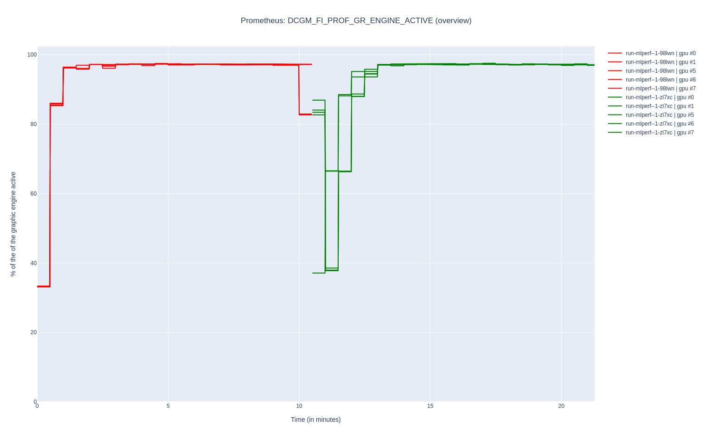
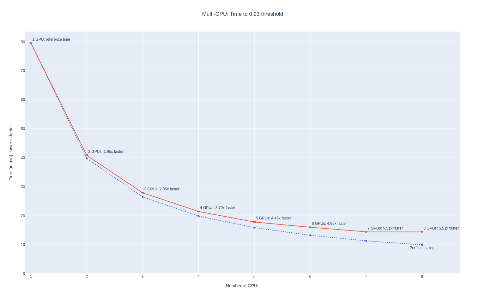
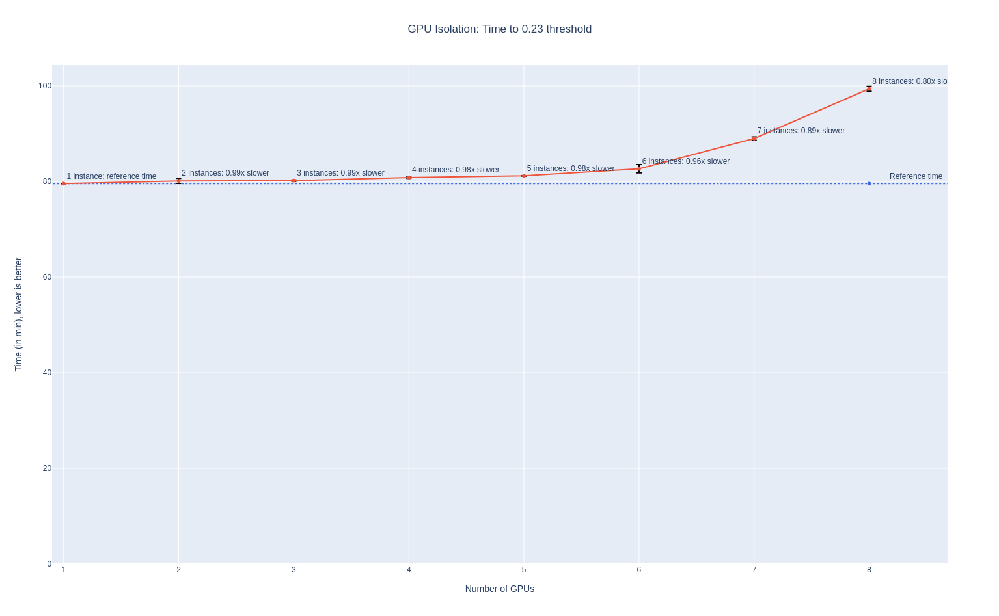

Functional and Performance Testing of the NVIDIA DGX-A100
=========================================================

_By Kevin Pouget_

In this blog post, part of a series on the DGX-A100 OpenShift
launch, we present the functional and performance assessement we performed
to validate the behavior of the DGXA100 8x A100 GPUs. This study was
performed on OpenShift 4.9 with the GPU computing stack deployed by
the GPU Operator v1.9. It is a follow-up on our previous work on
[enabling MIG support in the GPU Operator] and
[benchmarking AI/ML performance on a single A100 GPU].

In this work, we paid particular attention to the reproducibility of
the functional and performance tests, so that the whole testing
procedure can be easily re-executed in any freshly deployed OpenShift
cluster.

For the workload running on the GPUs, we chose the NVIDIA PyTorch
implementation of the Single Shot Detector (SSD) AI/ML model, from
[MLCommons MLPerf v0.7 repository],
running against [the COCO dataset](https://cocodataset.org/).

In the following sections, we first describe how we prepared the
cluster, then we go through the functional testing of the MIG
partitioning control of the GPU Operator. Then, we present the
performance benchmarking we performed to validate the speed up gain
when using multiple GPUs to run the SSD algorithm, and the
performance isolation when running multiple independent workloads on
each of the GPUs.

[enabling MIG support in the GPU Operator]: https://cloud.redhat.com/blog/multi-instance-gpu-support-with-the-gpu-operator-v1.7.0
[benchmarking AI/ML performance on a single A100 GPU]: https://cloud.redhat.com/blog/using-nvidia-a100s-multi-instance-gpu-to-run-multiple-workloads-in-parallel-on-a-single-gpu
[MLCommons MLPerf v0.7 repository]: https://github.com/mlcommons/training_results_v0.7/tree/master/NVIDIA/benchmarks/ssd/implementations/pytorch

Cluster Preparation
===================

Install and Configure the Operators
-----------------------------------

In order to prepare the cluster for running the tests and benchmarks,
a few operators must be deployed and configured:

1. The [OpenShift Node Feature Discovery Operator].
This operator is in charge of labeling the worker nodes with hardware
and system properties. It is a prerequisite for the NVIDIA GPU
Operator, as it detects NVIDIA GPU PCI cards and advertises them on
the node label `feature.node.kubernetes.io/pci-10de.present=true`.
Do not forget to create the default `NodeFeatureDiscovery` custom
resource.

[OpenShift Node Feature Discovery Operator]: https://docs.openshift.com/container-platform/4.9/hardware_enablement/psap-node-feature-discovery-operator.html

2. The [NVIDIA GPU Operator].  This operator is the
cornerstone of this work. It deploys the GPU computing stack,
including the kernel driver, in all of the GPU nodes. Since v1.9.0,
[the deployment of RHEL entitlement is not necessary anymore]. With the
help of NFD labels, the GPU Operator will automatically detect the DGX
A100 node and install (via containers) the necessary drivers, services
and CUDA libraries to run GPU workload.
Do not forget to create the default `ClusterPolicy` custom resource

[NVIDIA GPU Operator]: https://docs.nvidia.com/datacenter/cloud-native/gpu-operator/openshift/contents.html
[the deployment of RHEL entitlement is not necessary anymore]: https://cloud.redhat.com/blog/entitlement-free-deployment-of-the-nvidia-gpu-operator-on-openshift

3. The [OpenShift Local Storage Operator].
This operator allows storing persistent data on the local disks or
partitions. See our own [LocalVolume resource] as an example, but make sure to
adapt it to the hardware setup of your system. The only requirement is to expose
a `StorageClass` (named `local-sc-dgx` in our illustrations)
that can be used later on to create a `PersistentVolumeClaim`, with
at least 30 GB of available disk space.

[OpenShift Local Storage Operator]: https://docs.openshift.com/container-platform/4.9/storage/persistent_storage/persistent-storage-local.html
[LocalVolume resource]: cluster_setup.md


Prepare the dataset and the container image
-------------------------------------------

Once the operators have been installed and configured, we must prepare the
cluster to run the benchmark:

1. Prepare a `PersistentVolumeClaim` for storing the dataset

```
PVC_NAME=benchmarking-coco-dataset
NAMESPACE=default
STORAGE_CLASS_NAME=local-sc-dgx

cat <<EOF | oc apply -f-
apiVersion: v1
kind: PersistentVolumeClaim
metadata:
  name: $PVC_NAME
  namespace: $NAMESPACE
spec:
  accessModes:
    - ReadWriteOnce
  resources:
    requests:
      storage: 80Gi
  storageClassName: $STORAGE_CLASS_NAME
EOF
```

2. Download the [COCO dataset] and extract it in the persistent storage

   1. Create the entrypoint script `ConfigMap`. See our [entrypoint `ConfigMap`](download_coco_dataset/000_configmap_coco-dataset_entrypoint.yml).
   2. Create the `Pod` itself, and wait for its completion. See our [download `Pod`](download_coco_dataset/002_pod_coco-dataset.yml).

[COCO dataset]: https://cocodataset.org/#home

3. Create an `ImageStream` for creating the MLPerf SSD container
image, and create a `BuildConfig` to turn the repository into a
container image:
```
NAMESPACE=default
cat <<EOF | oc apply -f-
kind: ImageStream
apiVersion: image.openshift.io/v1
metadata:
  name: mlperf
  namespace: $NAMESPACE
  labels:
    app: mlperf
spec: {}
EOF
```
```
NAMESPACE=default
cat <<EOF | oc apply -f-
apiVersion: build.openshift.io/v1
kind: BuildConfig
metadata:
  labels:
    app: mlperf
  name: mlperf0.7
  namespace: $NAMESPACE
spec:
  output:
    to:
      kind: ImageStreamTag
      name: mlperf:ssd_0.7
      namespace: default
  resources: {}
  source:
    type: Git
    git:
      uri: "https://github.com/openshift-psap/training_results_v0.7.git"
      ref: "fix/build-error-ssd"
    contextDir: NVIDIA/benchmarks/ssd/implementations/pytorch
  triggers:
  - type: "ConfigChange"
  strategy:
    type: Docker
    dockerStrategy: {}
EOF
```

At the end of the `Build` execution, the `ImageStream` will contain a
container image that can be used by the Pods in the same namespace:

```
image-registry.openshift-image-registry.svc:5000/default/mlperf:ssd_0.7
```

Note that this `BuildConfig` points to our fork on the
`training_results_v0.7` repository because of
[a bug](https://github.com/containers/buildah/issues/3708) in the
image build chain, leading to a failure in the image build. Our fork
simply reorganizes the content of the `Dockerfile` to avoid hitting
the problem, and the rest of the repository is untouched.

Customization of the GPU Operator
---------------------------------

The GPU Operator ships a
[default list of possible MIG configurations], where all the GPUs of a
given node all have the same configuration. This list can be
overridden by a custom configuration file, allowing a finer-grain
configuration of each of the GPUs. As part of our functional testing,
we apply a custom configuration file, extending the default list with
this entry (from [the NVIDIA MIG-Parted repository]):

[default list of possible MIG configurations]: https://gitlab.com/nvidia/kubernetes/gpu-operator/-/blob/v1.9.0/assets/state-mig-manager/0400_configmap.yaml
[the NVIDIA MIG-Parted repository]: https://github.com/NVIDIA/mig-parted

```
version: v1
mig-configs:
   ...
  custom-config:
    - devices: [0,1,2,3]
      mig-enabled: false
    - devices: [4]
      mig-enabled: true
      mig-devices:
        "1g.5gb": 7
    - devices: [5]
      mig-enabled: true
      mig-devices:
        "2g.10gb": 3
    - devices: [6]
      mig-enabled: true
      mig-devices:
        "3g.20gb": 2
    - devices: [7]
      mig-enabled: true
      mig-devices:
        "1g.5gb": 2
        "2g.10gb": 1
        "3g.20gb": 1
```
```
oc apply -f https://github.com/NVIDIA/mig-parted/blob/a27f0bb01f1effd0866a29d28963340540bf85c3/examples/config.yaml

oc patch clusterpolicy/gpu-cluster-policy --type='json' -p='[{"op": "replace", "path": "/spec/migManager/config", "value": {"name": "custom-mig-config"}}]'
```

Once all of these steps have been carried out, the cluster is ready
for executing our benchmark suite. In the following section, we
present the reproducible benchmarking environment we used for running the
GPU computing validation benchmarks on the DGX A100 system.

Reproducible Benchmarking Environment
=====================================

Running the validation benchmarks can be done manually, by instantiating
the Kubernetes resources and waiting for the completion of the workload
jobs. However, this would not scale well, when the number of
benchmarks to run starts to get large.

To solve this problem, we used the [`MatrixBenchmarking`] framework,
which allows specifying a list of workload configurations that should
be benchmarked. See this configuration file for the settings we used
in this work, and this directory for the code used for running and plotting
the benchmark.

[`MatrixBenchmarking`]: https://github.com/openshift-psap/matrix-benchmarking/tree/693be58f72c2f8f96fd3f77f6e6d08637b183c4e
[this configuration file]: https://github.com/openshift-psap/matrix-benchmarking-workloads/blob/5edb9e2da0d696a965c58d7c52b39c6e80c37e1c/mlperf/benchmarks/benchmark-dgx.yaml
[this directory]: https://github.com/openshift-psap/matrix-benchmarking-workloads/tree/5edb9e2da0d696a965c58d7c52b39c6e80c37e1c/mlperf

MatrixBenchmarking: Run and Plot Benchmarks Configurations
-------------------------------------------------------

`MatrixBenchmarking` is a framework for running various combinations
of benchmarking parameters, storing execution artifacts and plotting
the results. The tool is agnostic to the workload being benchmarked;
the configuration file (`benchmark.yaml`) defines the configurations
that should be tested, as well as how to execute it and where to store
the results.

The following components are required to run the benchmark, parse the
results and visualize them:

1. [A benchmark execution script], independent from the rest of the
framework (further described in the following subsection).
2. [A Python storage module], which parses the content of the artifact
directories, and stores the raw measurements into Python structures.
3. [A Python visualization module], which transforms the measurements into
[Plotly](https://plotly.com/python/) graphs.

[A benchmark execution script]: https://github.com/openshift-psap/matrix-benchmarking-workloads/tree/5edb9e2da0d696a965c58d7c52b39c6e80c37e1c/mlperf/exec
[A Python storage module]: https://github.com/openshift-psap/matrix-benchmarking-workloads/blob/5edb9e2da0d696a965c58d7c52b39c6e80c37e1c/mlperf/store.py
[A Python visualization module]: https://github.com/openshift-psap/matrix-benchmarking-workloads/tree/5edb9e2da0d696a965c58d7c52b39c6e80c37e1c/mlperf/plotting


The `MatrixBenchmarking` framework combines these modules and provides
two commands:

1. `benchmark` to run all the benchmark configurations that did not
terminate successfully yet,
2. `visualize` to parse the benchmark artifacts, and provide a dynamic
Web interface to visualize the data results.

In the following subsections, we present more concretely the script in
charge of running the MLPerf SSD benchmark, according to the
configuration settings provided by the `MatrixBenchmarking`
framework. We also present how the script stores reproduction
artifacts, to allow anyone to re-run a particular benchmark without
hassle; and observation artifacts, to allow studying the exact setup
in which the benchmark ran.

Execution of the SSD benchmark on OpenShift: `run_ssd.py`
---------------------------------------------------------

[`run_ssd.py`] is our script in charge of launching the MLPerf
benchmark on OpenShift. It configures the GPUs and the GPU Kubernetes
stack according to the benchmark requirements (GPU MIG configuration,
MIG advertisement), then prepares and instantiates the Kubernetes
workload Jobs and waits for the termination of its Pods. The script
enforces the proper coordination of the different steps (eg, cleanup
of any dangling Pod, awaiting for reconfiguration of the GPUs,
validation of the Pod successful execution, ...). It reports an error
if anything goes wrong, so that the `MatrixBenchmarking` framework knows
that this run was not successful and should be re-executed later on.

[`run_ssd.py`]: https://github.com/openshift-psap/matrix-benchmarking-workloads/blob/5edb9e2da0d696a965c58d7c52b39c6e80c37e1c/mlperf/exec/run_ssd.py

In addition to the execution coordination, the script captures
observation and reproduction artifacts. We describe these artifacts in
the following subsections.

Observation Artifacts
---------------------

Observation artifacts are critical for post-mortem studies of the
runtime environment in which the benchmark was executed. They can be
used to confirm some aspects of the configuration, or troubleshoot any
performance perk, etc. I the following, we present the list of
artifacts we currently gather for each of the benchmark execution:

- Cluster information: OpenShift `ClusterVersion/version` resource
  definition
- Node information: the Node resource definition
- GPU stack information: the `ClusterPolicy` resource definition
- Workload information:
  - The Jobs resource definitions
  - The Pods logs
  - The Pods image (name and SHA)
- GPU usage information:
  - The Prometheus start/stop timestamp
  - The GPU metrics generated between these timestamps
- Benchmark execution information:
  - The exit code of run_ssd.py execution
    - This tells if the execution was successful
  - The benchmark settings being tested
    - This tells what configuration was being tested
  - The logs of run_ssd.py execution
    - This contains the performance indicators generated by the
      application

The second part of the artifacts generated by the benchmark relates to
the reproduction artifacts.

Reproduction steps
------------------

Reproduction artifacts provide an easy way to re-execute a particular
configuration of the benchmark, by providing all the relevant
configuration bits. See [`run_from_artifacts.sh`] for a minimal sample
script re-executing a given benchmark. The artifacts stored for
re-execution are the following:

[`run_from_artifacts.sh`]: https://github.com/openshift-psap/matrix-benchmarking-workloads/blob/5edb9e2da0d696a965c58d7c52b39c6e80c37e1c/mlperf/exec/run_from_artifacts.sh

- Kubernetes environment:
  - `app_name`: name of the Job app label, used for tracking the Pods
    running the workload
  - `namespace`: namespace where the resources are created
- GPU configuration:
  - `mig-strategy.txt`: the MIG advertisement strategy to configure in
    the `ClusterPolicy`
  - `mig-label.txt`: the MIG label to apply to the DGX node
  - `entrypoint.cm.yaml`: the entrypoint script controlling the
    workload execution in the Pods
  - `job_spec.run-ssd.yaml`: the Job defining the benchmark workload

Along with the cluster setup presented in the previous section, these
artifacts should be enough to reproduce the benchmark execution.

In the following subsection, we describe the functional testing we
performed on the DGX A100, to validate the good behavior of the NVIDIA
GPU Operator with the eight MIG-capable GPUs.

Testing of the MIG capabilities
===============================

The DGX A100 offers eight MIG-capable GPUs. In this section, we
present different tests we ran to validate that the GPU Operator is
able to properly configure the MIG GPUs. The original work on dynamic
MIG reconfiguration was presented in [this blog post], and it is also
documented on [the GPU Operator web page].

[this blog post]: https://cloud.redhat.com/blog/multi-instance-gpu-support-with-the-gpu-operator-v1.7.0
[the GPU Operator web page]: https://docs.nvidia.com/datacenter/cloud-native/gpu-operator/openshift/mig-ocp.html

`single` advertisement strategy
-------------------------------

With the single advertisement strategy, the GPU Operator exposes the
MIG GPUs with the same tag as full GPUs: `nvidia.com/gpus`. This
advertisement strategy is useful for full compatibility with full
GPUs, as it does not require modifying the resource tag requested by
the Pods. The node labels indicate the MIG slicing through the
`nvidia.com/gpu.product` label.

Example of configuration:

| MIG configuration | Node product label | Cluster Policy MIG strategy |
| :---: | :---: | :---: |
| `nvidia.com/mig.config` | `nvidia.com/gpu.product` | `spec.mig.strategy` |
| `all-7g.40gb` | `NVIDIA-A100-SXM4-40GB-MIG-7g.40gb`  | `single` |

| Node GPU labels | Node GPU count |
| :---: | :---: |
| `nvidia.com/nvidia.com.count` | `8`  |


### Requesting one GPUs per Pod in 8 Pods

- [Test artifacts](https://github.com/openshift-psap/blog-artifacts/blob/1f368b17f180c9ceaa5660eb32acb57256f4df0b/DGX-A100_GPU-Operator_testing/results/mlperf/dgx-test/20211209/gpu=7g.40gb_1gpu_x_8pod/run_20211209_1519.4e94)
- Job parallelism: `8`
- Container resources:
```
resources:
  limits:
    nvidia.com/gpu: "1"
  requests:
    nvidia.com/gpu: "1"
```
- `nvidia-smi -L` (from one of the Pods)
```
GPU 0: NVIDIA A100-SXM4-40GB (UUID: GPU-55b69871-247e-9b99-a60a-7daca59a4108)
  MIG 7g.40gb     Device  0: (UUID: MIG-62f7dc39-4870-51c0-9b21-86def482903a)
```

### Requesting all the GPUs in one Pod

- [Test artifacts](https://github.com/openshift-psap/blog-artifacts/blob/1f368b17f180c9ceaa5660eb32acb57256f4df0b/DGX-A100_GPU-Operator_testing/results/mlperf/dgx-test/20211209/gpu=7g.40gb_8gpu_x_1pod/run_20211209_1519.57ea)
- Job parallelism: `1`
- Container resources:
```
resources:
  limits:
    nvidia.com/gpu: "8"
  requests:
    nvidia.com/gpu: "8"
```
- `nvidia-smi -L`
```
GPU 0: NVIDIA A100-SXM4-40GB (UUID: GPU-4dd97325-7fe6-abf1-d6a9-ba746fe0fdab)
  MIG 7g.40gb     Device  0: (UUID: MIG-7008cac5-5da7-5b37-9ddd-3f44ece79169)
GPU 1: NVIDIA A100-SXM4-40GB (UUID: GPU-9e13f17f-a213-eb38-9a9c-0b2a540e4908)
  MIG 7g.40gb     Device  0: (UUID: MIG-ac2471ee-ea05-55fe-b7d7-8c31210e7a6e)
GPU 2: NVIDIA A100-SXM4-40GB (UUID: GPU-1ae21a3c-f40b-77a7-002f-4b0b52b05f5b)
  MIG 7g.40gb     Device  0: (UUID: MIG-960c229f-92b5-5543-8eb5-2999f26ef6b8)
GPU 3: NVIDIA A100-SXM4-40GB (UUID: GPU-eeb0f073-2f03-6035-72a3-7b1ac76c5a72)
  MIG 7g.40gb     Device  0: (UUID: MIG-60bbf248-9d3f-5386-9ff5-6af012397026)
GPU 4: NVIDIA A100-SXM4-40GB (UUID: GPU-c9297a60-5079-9a56-b935-51e08dc0f65e)
  MIG 7g.40gb     Device  0: (UUID: MIG-eba8b28b-434d-510c-806c-10304eb92e21)
GPU 5: NVIDIA A100-SXM4-40GB (UUID: GPU-4fb17cd5-cad8-31a6-34d3-08434d926140)
  MIG 7g.40gb     Device  0: (UUID: MIG-e4b043ba-742f-5607-806e-29b77f044f60)
GPU 6: NVIDIA A100-SXM4-40GB (UUID: GPU-55b69871-247e-9b99-a60a-7daca59a4108)
  MIG 7g.40gb     Device  0: (UUID: MIG-62f7dc39-4870-51c0-9b21-86def482903a)
GPU 7: NVIDIA A100-SXM4-40GB (UUID: GPU-fccb396c-ecba-9822-6217-a790cd2c9d3f)
  MIG 7g.40gb     Device  0: (UUID: MIG-a0f08426-7343-531e-9087-0a203fe1ab9f)
```

### Requesting more GPUs than available, in two Pods

In this test case, we request five GPUs in two Pods, while only eight
GPUs are available in the system. Kubernetes Pod scheduler detects
that there are not enough GPU resources available to schedule the
second Pod, so it delays it until the resources are released. Hence,
the execution of the two Pods is sequential.

- [Test artifacts](https://github.com/openshift-psap/blog-artifacts/blob/1f368b17f180c9ceaa5660eb32acb57256f4df0b/DGX-A100_GPU-Operator_testing/results/mlperf/dgx-test/20211209/gpu=7g.40gb_5gpu_x_2pod/run_20211209_1519.e78a)
- Job parallelism: `2`
- Container resources:
```
resources:
  limits:
    nvidia.com/gpu: "5"
  requests:
    nvidia.com/gpu: "5"
```
- `nvidia-smi -L` (from one of the Pods)
```
GPU 0: NVIDIA A100-SXM4-40GB (UUID: GPU-4dd97325-7fe6-abf1-d6a9-ba746fe0fdab)
  MIG 7g.40gb     Device  0: (UUID: MIG-7008cac5-5da7-5b37-9ddd-3f44ece79169)
GPU 1: NVIDIA A100-SXM4-40GB (UUID: GPU-9e13f17f-a213-eb38-9a9c-0b2a540e4908)
  MIG 7g.40gb     Device  0: (UUID: MIG-ac2471ee-ea05-55fe-b7d7-8c31210e7a6e)
GPU 2: NVIDIA A100-SXM4-40GB (UUID: GPU-1ae21a3c-f40b-77a7-002f-4b0b52b05f5b)
  MIG 7g.40gb     Device  0: (UUID: MIG-960c229f-92b5-5543-8eb5-2999f26ef6b8)
GPU 3: NVIDIA A100-SXM4-40GB (UUID: GPU-55b69871-247e-9b99-a60a-7daca59a4108)
  MIG 7g.40gb     Device  0: (UUID: MIG-62f7dc39-4870-51c0-9b21-86def482903a)
GPU 4: NVIDIA A100-SXM4-40GB (UUID: GPU-fccb396c-ecba-9822-6217-a790cd2c9d3f)
  MIG 7g.40gb     Device  0: (UUID: MIG-a0f08426-7343-531e-9087-0a203fe1ab9f)
```

The sequential execution of the two Pods is visible in this plot of the
`DCGM_FI_PROF_GR_ENGINE_ACTIVE` metrics exported by the NVIDIA DCGM
exporter:



`mixed` advertisement strategy
------------------------------

The `mixed` advertisement strategy exposes MIG GPUs with a custom
resource tag, indicating the number of compute units and memory
available for the instance, eg: `nvidia.com/mig-7g-40gb`, for the
biggest slice of the A100-40GB GPU. This advertisement strategy breaks
the compatibility with full GPUs, but allows heterogeneous MIG
slicing.

Example of configuration:

| MIG configuration | Node product label | Cluster Policy MIG strategy |
| :---: | :---: | :---: |
| `nvidia.com/mig.config` | `nvidia.com/gpu.product` | `spec.mig.strategy` |
|  `all-balanced` | `NVIDIA-A100-SXM4-40GB`|  `mixed`  |

| Node MIG labels | Node MIG count |
| :---: | :---: |
| `nvidia.com/mig-3g.20gb.count` | `8`  |
|`nvidia.com/mig-2g.10gb.count` | `8`  |
|`nvidia.com/mig-1g.5gb.count`  | `16` |


### Requesting 1 `MIG-2g.10gb` GPUs in 24 Pods

- [Test artifacts](https://github.com/openshift-psap/blog-artifacts/blob/1f368b17f180c9ceaa5660eb32acb57256f4df0b/DGX-A100_GPU-Operator_testing/results/mlperf/dgx-test/20211209/gpu=2g.10gb_1gpu_x_24pod/run_20211210_1552.e1c8/)
- MIG configuration: `nvidia.com/mig.config=all-2g.10gb`
- Job parallelism: `24`
- Container resources:
```
resources:
  limits:
    nvidia.com/mig-2g.10gb: "1"
  requests:
    nvidia.com/mig-2g.10gb: "1"
```
- `nvidia-smi -L` (from one of the Pods)
```
GPU 0: NVIDIA A100-SXM4-40GB (UUID: GPU-55b69871-247e-9b99-a60a-7daca59a4108)
  MIG 2g.10gb     Device  0: (UUID: MIG-8c8a56c5-2703-5237-bcc3-a51a5d897ea8)
```

### Requesting 24 `MIG-2g.10gb` GPUs in 1 Pod

- [Test artifacts](https://github.com/openshift-psap/blog-artifacts/blob/1f368b17f180c9ceaa5660eb32acb57256f4df0b/DGX-A100_GPU-Operator_testing/results/mlperf/dgx-test/20211209/gpu=2g.10gb_24gpu_x_1pod/run_20211210_1552.517e)
- MIG configuration: `nvidia.com/mig.config=all-2g.10gb`
- Job parallelism: `1`
- Container resources:
```
resources:
  limits:
    nvidia.com/mig-2g.10gb: "24"
  requests:
    nvidia.com/mig-2g.10gb: "24"
```
- `nvidia-smi -L`

```
GPU 0: NVIDIA A100-SXM4-40GB (UUID: GPU-4dd97325-7fe6-abf1-d6a9-ba746fe0fdab)
  MIG 2g.10gb     Device  0: (UUID: MIG-89d05d6f-212a-5e57-8253-60f252e63667)
  MIG 2g.10gb     Device  1: (UUID: MIG-56d4c7d7-797c-5ce8-a579-bcfb19a4d1f1)
  MIG 2g.10gb     Device  2: (UUID: MIG-f7fcc8ba-34b5-573e-b4f3-71f624997288)
GPU 1: NVIDIA A100-SXM4-40GB (UUID: GPU-9e13f17f-a213-eb38-9a9c-0b2a540e4908)
  MIG 2g.10gb     Device  0: (UUID: MIG-03038366-f352-51a7-83a4-3b3a43744912)
  MIG 2g.10gb     Device  1: (UUID: MIG-47302280-e35a-505b-880f-886d4b4260a1)
  MIG 2g.10gb     Device  2: (UUID: MIG-3725f00f-ea29-50a3-bd07-e08f5b01f3b8)
…
```


### Requesting multiple MIG instance types in multiple Pods

This test case creates two `Jobs` requesting 4 Pods. One of the `Job`
requests resources of type `nvidia.com/mig-3g.20gb` and the second one
requests resources of type `nvidia.com/mig-2g.10gb`.

- [Test artifacts](https://github.com/openshift-psap/blog-artifacts/blob/1f368b17f180c9ceaa5660eb32acb57256f4df0b/DGX-A100_GPU-Operator_testing/results/mlperf/dgx-test/20211209/gpu=2g.10gb,3g.20gb_1gpu_x_4pod/run_20211209_1519.334c)
- MIG configuration: `nvidia.com/mig.config=all-balanced`
- Job parallelism: `4`
- Container resources:
```
resources:
  limits:
    nvidia.com/mig-3g.20gb: "1"
  requests:
    nvidia.com/mig-3g.20gb: "1"
```
- `nvidia-smi -L` (from one of the Pods)
```
GPU 0: NVIDIA A100-SXM4-40GB (UUID: GPU-9e13f17f-a213-eb38-9a9c-0b2a540e4908)
  MIG 3g.20gb     Device  0: (UUID: MIG-7af93043-695c-54c5-90f5-b698832ab413)
```

- Job parallelism: `4`
- Container resources:
```
resources:
  limits:
    nvidia.com/mig-2g.10gb: "1"
  requests:
    nvidia.com/mig-2g.10gb: "1"
```
- `nvidia-smi -L` (from one of the Pods)
```
GPU 0: NVIDIA A100-SXM4-40GB (UUID: GPU-9e13f17f-a213-eb38-9a9c-0b2a540e4908)
  MIG 2g.10gb     Device  0: (UUID: MIG-92240150-b9ae-56f3-af21-184911981ed8)
```

### Requesting multiple MIG instance types in 1 Pod: *not supported*

For illustration purpose only; this configuration is _not supported_
by the NVIDIA GPU Operator:

- MIG configuration: `nvidia.com/mig.config=all-balanced`
- Job parallelism: `1`
- Container resources:
```
resources: # this configuration is not supported
  limits:
    nvidia.com/mig-3g.20gb: "8"
    nvidia.com/mig-2g.10gb: "8"
  requests:
    nvidia.com/mig-3g.20gb: "8"
    nvidia.com/mig-2g.10gb: "8"
```

Defining a custom multi-GPU MIG configuration
---------------------------------------------

The GPU Operator provides a predefined list of possible MIG
configurations, for the different MIG-capable GPUs already
released. These configurations also work in a multi-GPU node, such as
the DGX A100, however the same MIG slicing will be applied to all the
GPUs of the node. It is possible to override this default
configuration by providing a custom ConfigMap containing the desired
configuration. See the [GPU Operator documentation] to find out how to
deploy such a configuration.

As part of our test bench, we applied the MIG-Parted
[sample multi-GPU configuration] named `custom-config`:

```
custom-config:
   - devices: [0,1,2,3]
      mig-enabled: false
    - devices: [4]
      mig-enabled: true
      mig-devices:
        "1g.5gb": 7
    - devices: [5]
      mig-enabled: true
      mig-devices:
        "2g.10gb": 3
    - devices: [6]
      mig-enabled: true
      mig-devices:
        "3g.20gb": 2
    - devices: [7]
      mig-enabled: true
      mig-devices:
        "1g.5gb": 2
        "2g.10gb": 1
        "3g.20gb": 1
```

[GPU Operator documentation]: https://docs.nvidia.com/datacenter/cloud-native/gpu-operator/openshift/mig-ocp.html#creating-and-applying-a-custom-mig-configuration
[sample multi-GPU configuration]: https://github.com/NVIDIA/mig-parted/blob/42717e6ef649f68be22f11cbf3117147518ce660/examples/config.yaml#L38

And to validate the proper slicing of all the GPUs, we launched a Pod
requesting 0 GPUs, meaning that we got access to all the GPUs of the
node:

- [Test artifacts](https://github.com/openshift-psap/blog-artifacts/blob/1f368b17f180c9ceaa5660eb32acb57256f4df0b/DGX-A100_GPU-Operator_testing/results/mlperf/dgx-test/20211209/gpu=2g.10gb_0gpu_x_1pod/run_20211217_1222.1e2f/)
- MIG configuration: `nvidia.com/mig.config=custom-config`
- Job parallelism: `1`
- Container resources:
```
resources:
  limits:
    nvidia.com/gpus: "0"
  requests:
    nvidia.com/gpus: "0"
```
- `nvidia-smi -L`
```
GPU 0: NVIDIA A100-SXM4-40GB (UUID: GPU-4dd97325-7fe6-abf1-d6a9-ba746fe0fdab)
GPU 1: NVIDIA A100-SXM4-40GB (UUID: GPU-9e13f17f-a213-eb38-9a9c-0b2a540e4908)
GPU 2: NVIDIA A100-SXM4-40GB (UUID: GPU-1ae21a3c-f40b-77a7-002f-4b0b52b05f5b)
GPU 3: NVIDIA A100-SXM4-40GB (UUID: GPU-eeb0f073-2f03-6035-72a3-7b1ac76c5a72)
GPU 4: NVIDIA A100-SXM4-40GB (UUID: GPU-c9297a60-5079-9a56-b935-51e08dc0f65e)
  MIG 1g.5gb      Device  0: (UUID: MIG-1c5876e6-d3b9-524a-9eb4-664fcfbd4de2)
  MIG 1g.5gb      Device  1: (UUID: MIG-934fe587-ac95-5d75-bf9e-f40befeb9b28)
  MIG 1g.5gb      Device  2: (UUID: MIG-4dcaea94-446a-522c-88e1-e8fb193ca789)
  MIG 1g.5gb      Device  3: (UUID: MIG-dd39e743-ed46-5a4a-bf9b-2d33388a6b61)
  MIG 1g.5gb      Device  4: (UUID: MIG-144a6174-a7a4-5b1f-85d2-4088e307aaa7)
  MIG 1g.5gb      Device  5: (UUID: MIG-f25c64a5-afbc-5311-bc04-6ba3b4212a2a)
  MIG 1g.5gb      Device  6: (UUID: MIG-42b3ba88-8dc5-5e51-9c89-76885370b661)
GPU 5: NVIDIA A100-SXM4-40GB (UUID: GPU-4fb17cd5-cad8-31a6-34d3-08434d926140)
  MIG 2g.10gb     Device  0: (UUID: MIG-bd4c1a2b-57e1-5df5-ac76-30cd1423b65e)
  MIG 2g.10gb     Device  1: (UUID: MIG-82b0c2d6-8829-56e4-9c64-f7ba16ae6c95)
  MIG 2g.10gb     Device  2: (UUID: MIG-7bd5246b-d60f-5700-9106-8457dd4ca03c)
GPU 6: NVIDIA A100-SXM4-40GB (UUID: GPU-55b69871-247e-9b99-a60a-7daca59a4108)
  MIG 3g.20gb     Device  0: (UUID: MIG-2944fa25-4112-52cc-a727-1cf09ba63e98)
  MIG 3g.20gb     Device  1: (UUID: MIG-4c7db5d8-f005-5927-803e-9ee984a56e15)
GPU 7: NVIDIA A100-SXM4-40GB (UUID: GPU-fccb396c-ecba-9822-6217-a790cd2c9d3f)
  MIG 3g.20gb     Device  0: (UUID: MIG-b9e81bd3-7504-588b-b3e7-d7607ea5e8ba)
  MIG 2g.10gb     Device  1: (UUID: MIG-1765bea3-82da-57d7-b4d7-21c06f58c24a)
  MIG 1g.5gb      Device  2: (UUID: MIG-0b5ad859-df2d-5646-9b82-407a9ab33f44)
  MIG 1g.5gb      Device  3: (UUID: MIG-2bcdbd01-44e6-5f68-ae6f-77448d2529f9)
```

This concludes the functional testing we performed on the DGX A100 to
validate the proper behavior of MIG slicing and GPU requesting. In the
following subsection, we present the results of the performance
benchmarking.

Benchmarking of the GPUs
========================

The second part of the DGX A100 testing consisted in the validation of
the GPU computing performance, in particular when multiple GPUs are
involved in the computation.

Multi-GPU Performance Benchmarking
----------------------------------

As a follow-up of [our previous work on benchmarking a single A100],
we continued with the MLPerf 0.7 SSD training benchmark, from the
PyTorch implementation submitted by NVIDIA. The benchmark was running
against the Coco 2017 benchmark.

[our previous work on benchmarking a single A100]: https://cloud.redhat.com/blog/using-nvidia-a100s-multi-instance-gpu-to-run-multiple-workloads-in-parallel-on-a-single-gpu

We ran the benchmark with 1, 2, 3, … or 8 GPUs working together on the
benchmark, with GPU Peer-to-peer communication done with the NVIDIA
NCCL library.

We obtained the following results, which show very good scaling
performance: the results (red line) are very close to the perfect
scaling (blue dotted line).



GPU Parallel Execution Isolation Benchmarking
---------------------------------------------

In the second part of the multi-GPU benchmarking, we wanted to
understand how the DGX A100 was able to run _independent_ workloads on
each of the GPUs. So we took the same benchmark configuration as in
the multi-GPU case, but we launched 1, 2, … 8 Pods of the benchmark,
all with one dedicated GPU. We used a shared directory to synchronize
the beginning of the execution (that is, wait for the right number of
Pods to signal that they are ready).

In the plot below, we took the 1-GPU execution as a reference time (no
parallelism), and compared it against the time it took for _all_ the
Pods to complete the benchmark.  We can see that with up to 5 or 6
GPUs running currently, there is barely no slowdown, but it starts to
rise up with 7 or 8 GPUs. This is most likely due to the saturation of
the bus between the main memory and the GPU memory.



Final words
===========

In this blog post, we presented how we performed the function
validation of the GPU Operator running on 8 GPUs of the DGX-A100. We
described the different Multi-Instance GPU (MIG) modes that we tested,
as well as how the values of the node labels and GPU resources for
these different settings. We also conducted a performance benchmark,
involving the 8 GPUs running simultaneously, either all training a
single AI/ML model, or all performing independent computations.

As a follow-up of this work, we're planning on doing more work around
AI/ML computing at large scale, such as multi-GPU multi-node training,
with multiple DGXA100 interconnected with NVIDIA GPUDirect RDMA
high-performance networks. To generate enough compute requirements,
we'll turn towards the greedy natural language models such as BERT or
Transformer-XL. Stay tuned!
